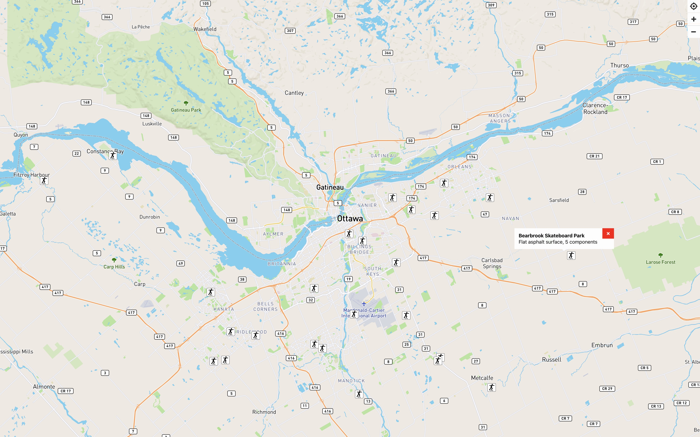

# application5
map application on react js(hooks)

## features
- [x] fetch map from mapbox(react-map-gl)
- [x] geolocate control, navigation control(zoom in & zoom out)
- [x] showing markers and popups based on a dataset(skateboard parks in otawa json: [http://data.ottawa.ca/dataset/skateboard-parks](http://data.ottawa.ca/dataset/skateboard-parks))

## demo
[https://saintsungminpark.github.io/application5](https://saintsungminpark.github.io/application3)
                
